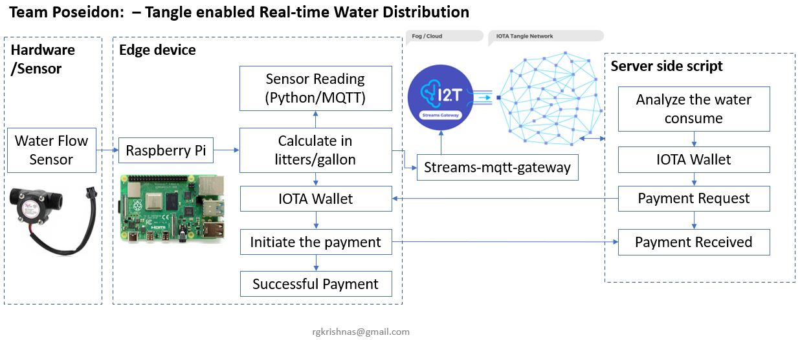
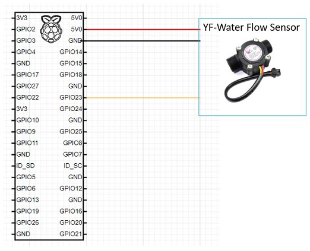
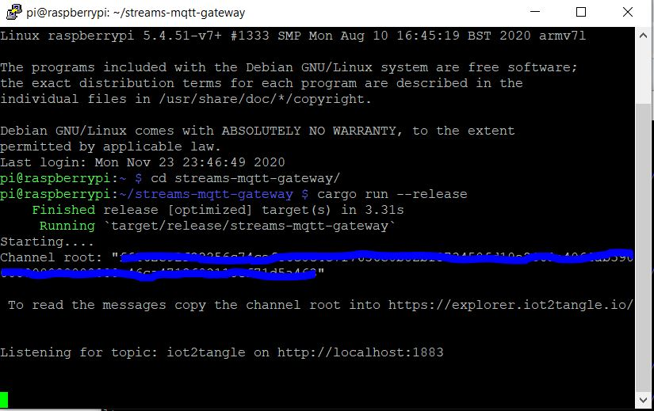
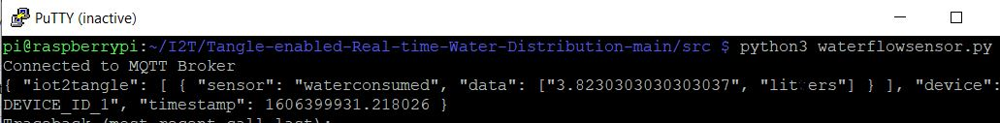
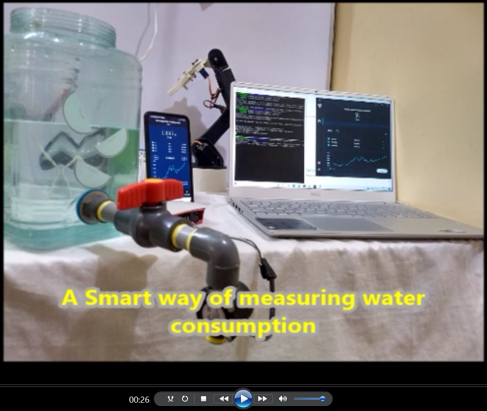

# Tangle enabled Real-time Water Distribution
## A Smart IOTA Tangle based Tamper-proof water distribution metering and Payment System.
Fresh water availability is taking a serious hit world-wide and is considered to be one of the main reasons that would trigger a third world war.
The current water distribution systems does not have the exact and real-time monitoring of water usage and metering is often done on average or approximate use. This PoC demonstrates the use of sensors to monitor real-time water usage along with integration of IOTA tangle to enable tamper proof data management with payment integration.
## Brief Overview
The Waterflow sensors stream waterflow to a processing unit(Raspberry Pi used in this PoC). A Python program runs to calculate the consumption and stores locally as well as streams to a Steams-MQTT-gateway. User can check the real-time water consumption or the accumulated consumption at any point of time. During the billing cycle, the charges for consumption is calculated in IOTA tokens and sent to the users client app. User can clear the dues which gets updated in IOTA wallet.
## Advantages
1. Real-time monitoring triggers alarms on water wastage due to possible leaks
2. Tamper-proof data management due to use of IOTA tangle technology
3. Smart system with exact real-time consumption measurements and automatic payment as pay per use
4. Simple and easy to install
5. Low cost sensor and hardware.
## Reference Architecture -(Water Distribution ecosystem)

## Required Hardware (BoM)
  1. [YF-Water Flow Sensor](https://robu.in/product/yf-s201-water-flow-measurement-sensor-with-1-30liter-min-flow-rate-2/?gclid=Cj0KCQiAkuP9BRCkARIsAKGLE8UxgRBkIr7N0A73nVRC6L-rj1wSw8ms-no1rjBF1aaWUuvCUBeDVyIaAiO2EALw_wcB)
     Approx. cost 300 INR
  2. [Raspberry Pi](https://www.raspberrypi.org/products/raspberry-pi-4-model-b/?resellerType=home) (We can do it in ESP32 as well - just for PoC we used Pi)
  3. Three strand [jumper wire set](https://robu.in/product/male-to-female-jumper-wires-40-pin-40cm/) (male to female)

## Schematic Diagram 
#### Wiring Connections between YF-Water flow Sensor and Pi
    - RED wire  to Pi 5V
    - Black wire to Pi GND
    - Yellow wire to Pi GPIO23

## Edge device installation/Configuration/How to execute the program
   1. Install [Raspberry Pi OS](https://www.raspberrypi.org/software/) - preferred OS is Buster 
   2. Power on the raspberry Pi
   3. Connect the Pi through SSH or desktop monitor
   4. Start installing IOTA dependency libraries and Smart Metering Programs
   * Install [Streams-mqtt-gateway](https://github.com/iot2tangle/Streams-mqtt-gateway) follow the link and install all dependencies 
     * Go to the Streams-mqtt-gateway folder 
     * Edit the config.json file and update the host name
     * Start the Stream-mqtt-gateway
       - $ cargo run --release
       - Copy the return seed for verification in tangle
       
     * **Install mqtt python library**
       - $ sudo pip install phao-mqtt
     * Install [pyota](https://github.com/iotaledger/iota.py) - if python2 is default try to install 
       - $ "sudo pip3 install pyota"
     * **Clone our [project repo](https://github.com/rgkrishnas/Tangle-enabled-Real-time-Water-Distribution) **
     * Open another console and go to smart metering project directory "Tangle-enabled-Real-time ..../src" in Pi 
     * Edit the config.py file and update the MQTT host name, user id, password and message topic
     * Run the below command for water consumption reading and auto payment
       - $ python3 waterflowsensor.py 
       
   5. Open the Valve which is connected in the water flow sensor (once the water flow is happened you could see the consumed water quantity in liter)
   6. A payment request will be initiated based on the set threshold value liters/gallon (Hardcoded as 1i for PoC purposes)
   7. Edge device will make the payment with the real-time water consumption.  

## PoC Demo Video

## Contacts
Gopal (rgkrishnas@gmail.com)
Sreekanth (rsreekanthr@gmail.com) 
