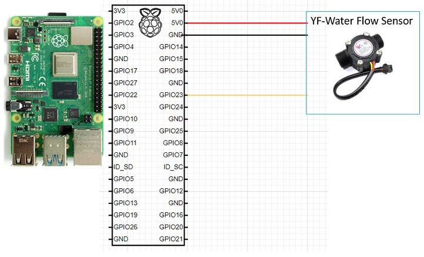

# Tangle enabled Real-time Water Distribution
## A Smart and Tamper-proof method for Water consumption payment system
Detect the water consumption in real-time and make auto payment as pay per use, store and analyze the data in tangle for tamper-proof IoT data
## Water Distribution ecosystem (Reference Architecture)

## Require Hardware
  1. [YF-Water Flow Sensor](https://robu.in/product/yf-s201-water-flow-measurement-sensor-with-1-30liter-min-flow-rate-2/?gclid=Cj0KCQiAkuP9BRCkARIsAKGLE8UxgRBkIr7N0A73nVRC6L-rj1wSw8ms-no1rjBF1aaWUuvCUBeDVyIaAiO2EALw_wcB)
     Approx. cost 300 INR
  2. Raspberry Pi (We can do it in ESP32 as well - just for PoC we used Pi)

## Wiring Connections between YF-Water flow Sensor and Pi
    - RED wire  to Pi 5V
    - Black wire to Pi GND
    - Yellow wire to Pi GPIO23
    
## Edge device installation
   1. [Streams-mqtt-gateway](https://github.com/iot2tangle/Streams-mqtt-gateway)
   2. Install mqtt python library
       sudo pip install phao-mqtt
   3. Clone our [project](https://github.com/rgkrishnas/Tangle-enabled-Real-time-Water-Distribution)
   4. Install [pyota](https://github.com/iotaledger/iota.py) if python2 is default try to install "sudo pip3 install pyota"
   
### How to run the program and sample output
1. Power the Pi 
2. Go to the Streams-mqtt-gateway folder and start run
   $ cargo run --release
   Copy the seed for verification
3. Go to our project directory "Tangle-enabled-Real-time ...." where you cloned and run the below command
   $ python3 waterflowsensor.py
4. Open the Valve (once the water flow is happened you could see the consumed water quantity in litters)
5. A payment request will be initiated based on some litters/gallon threashold value
6. Edge device will make the payment with the real-time consumed water.

## Payment system

## Demo Video

## Contacts
Gopal (rgkrishnas@gmail.com)
